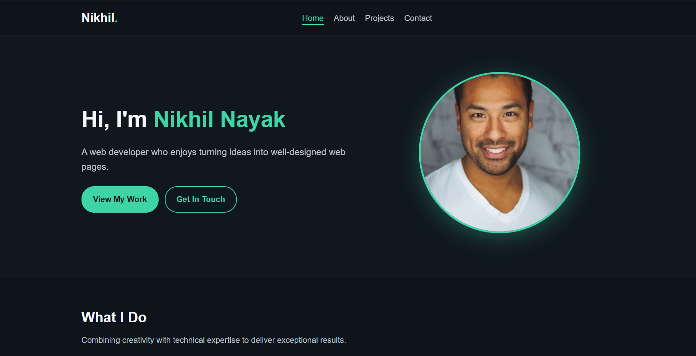
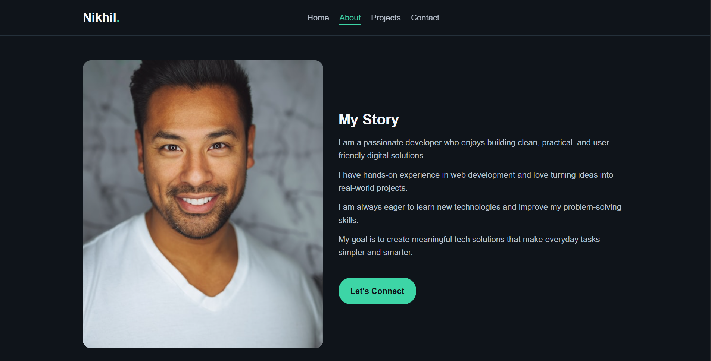
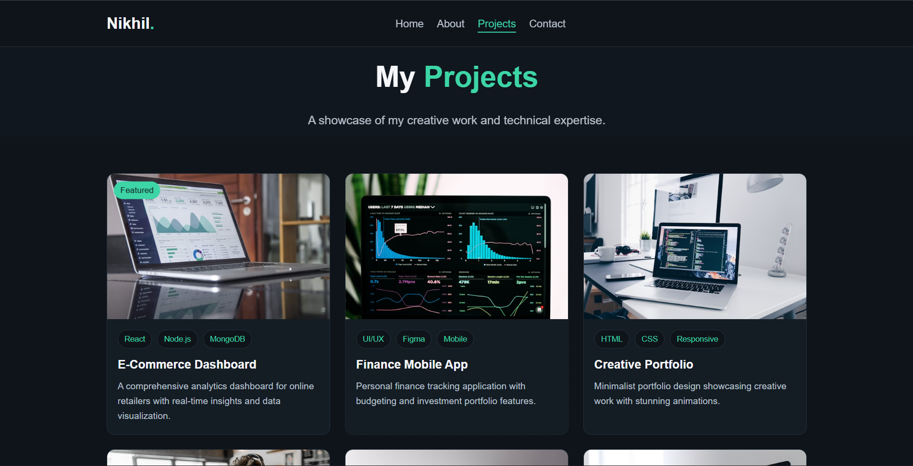
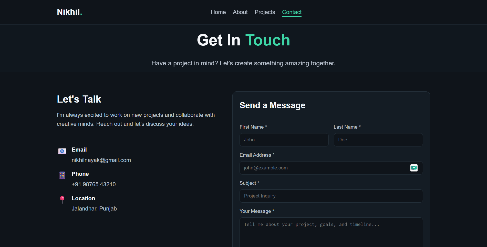
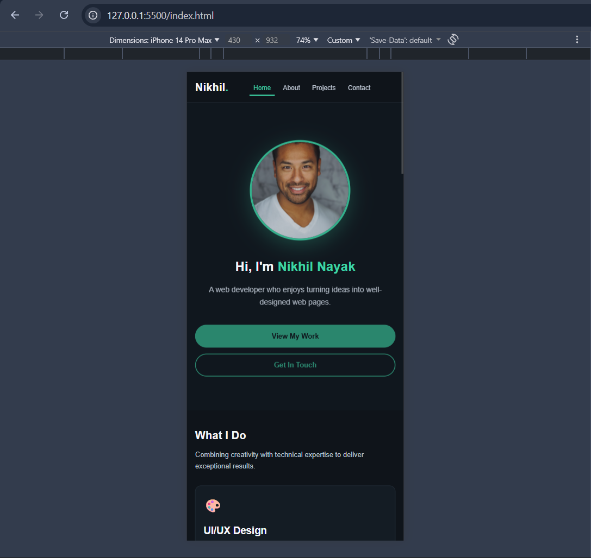
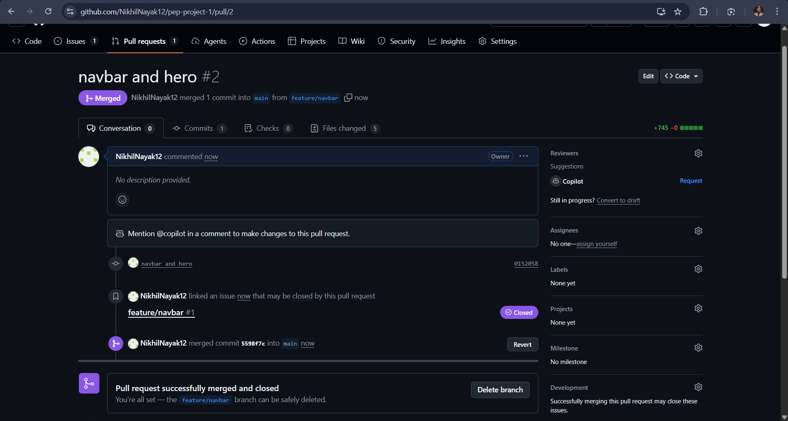
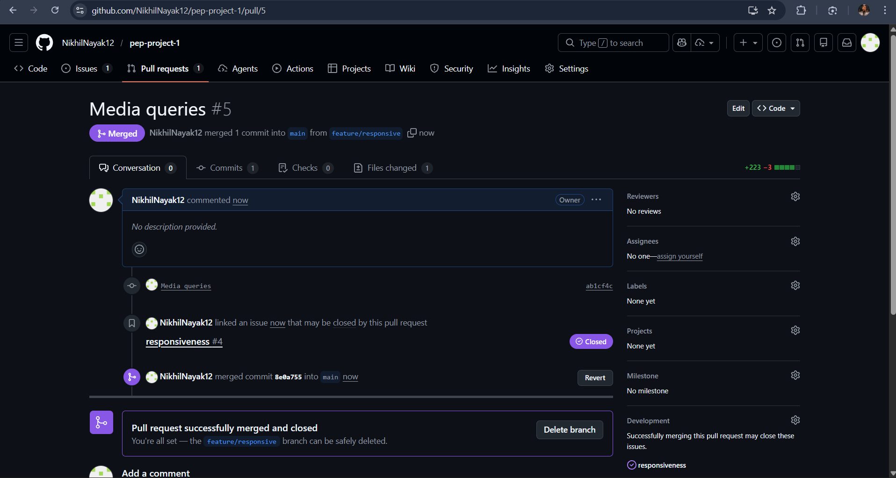
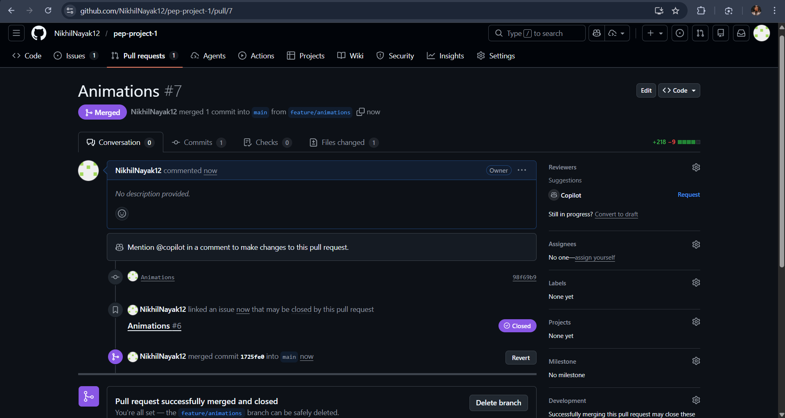

# Portfolio Website - Nikhil Nayak

## 🚀 Live Demo

**[View Live Site](https://nikhilnayak12.github.io/pep-project-1/)**

## 📋 Project Description

A modern, responsive portfolio website showcasing my work as a web developer and designer. The website features a clean dark theme with smooth CSS animations and a fully responsive layout that works seamlessly across all devices - from desktop to mobile.

## 🛠️ Tech Stack

- **HTML5** - Semantic markup
- **CSS3** - Custom properties, Grid, Flexbox, animations
- **Google Fonts** - Inter and Poppins typography
- **GitHub Pages** - Hosting and deployment

## 📸 Screenshots

### Home Page

### About Page

### Projects Page

### Contact Page

### Mobile Responsive

### Pull Requests

## 🎓 What I Learned

### Technical Skills
- **Advanced CSS Animations** - Created complex keyframe animations with staggered delays and smooth transitions
- **Responsive Design** - Implemented mobile-first approach with multiple breakpoints (1024px, 768px, 600px, 480px)
- **CSS Architecture** - Organized styles using CSS custom properties for easy theming and maintenance
- **Layout Techniques** - Mastered CSS Grid and Flexbox for flexible, modern layouts

### Key Takeaways
- CSS variables make theming and maintenance much easier
- Mobile-first design simplifies responsive development
- Semantic HTML improves accessibility and SEO
- Animation performance is crucial - used transform and opacity for GPU acceleration

---

**Nikhil Nayak** | [@NikhilNayak12](https://github.com/NikhilNayak12)
